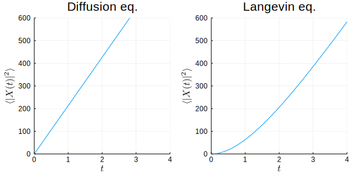
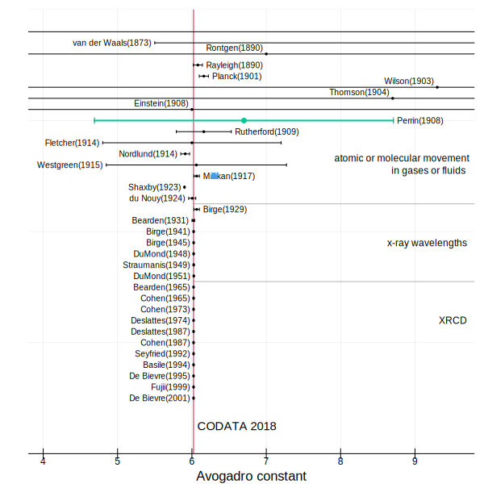
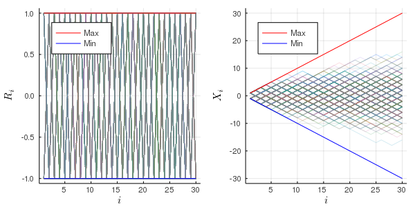
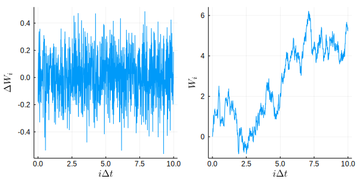
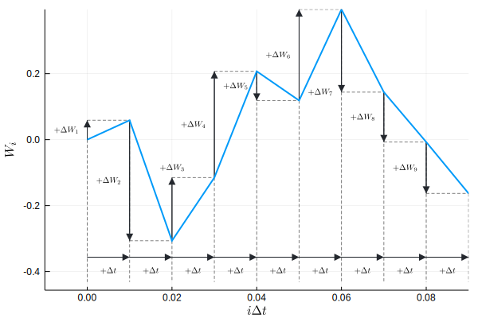
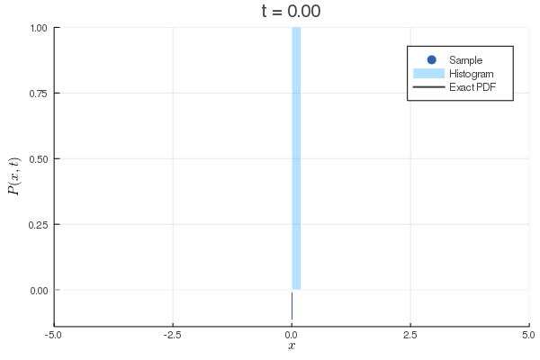
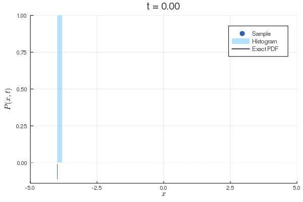
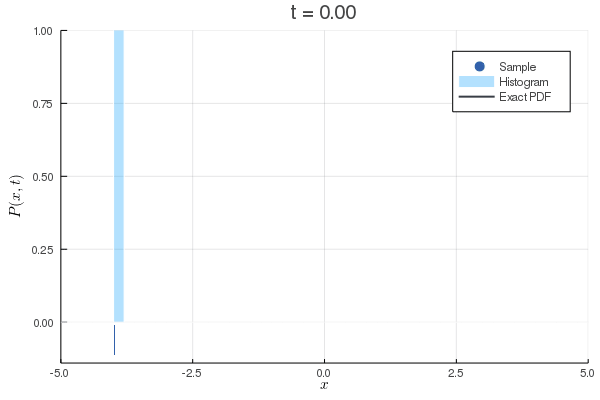
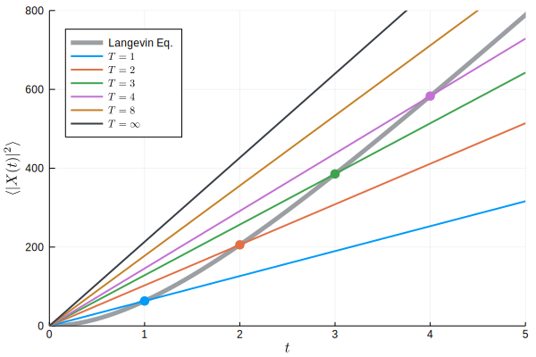

<!-- _class: title -->
# Julia言語によるLangevin方程式の数値計算

横浜市立大学大学院
生命ナノシステム科学研究科 前期博士課程 物質システム科学専攻
量子物理化学研究室

大野 周平

2021年10月23日(土) @ [第8回 ぶつりがく徒のつどい](http://physicstsudoi.client.jp/Info.html)

---

<!-- _class: subtitle -->
# はじめに

本講演ではLangevin方程式の歴史背景と数値解法について概説する.


計算には[Julia言語](https://julialang.org/), 描写には[Plots.jl](http://docs.juliaplots.org/latest/)を用いた. 全てのソースコードは[講義ノート](https://ohno.github.io/butsudoi2021/note/note.html)にまとめてある.
[講義ノート](https://ohno.github.io/butsudoi2021/note/note.html)は[IJulia.jl](https://github.com/JuliaLang/IJulia.jl)による[Jupyter Notebook](https://jupyter.org/)でまとめており, 計算や描写はノート上で行った.
[このスライド](https://ohno.github.io/butsudoi2021/slides/slides.html)は[Marp for VS Code](https://marketplace.visualstudio.com/items?itemName=marp-team.marp-vscode)を用いて作成した.

---

# 資料

資料は全て https://github.com/ohno/butsudoi2021 にアップロードしてあります.

質問・指摘等は https://github.com/ohno/butsudoi2021/discussions にお願いします.

---

# Julia言語

[Julia言語](https://julialang.org/)とは2018年にバージョン1.0がリリースされた [Pythonのように書けて, Cのように動く](https://www.coronasha.co.jp/np/isbn/9784339029055/) 次世代のプログラミング言語である. JuliaはPythonの書きやすさとCの速さを両立しており, さらにFortranに比類する強力な配列操作と行列演算が可能である. 単体での性能もさることながら, Python, C, Fortranの豊富なライブラリを呼び出すなど, 他言語との糊の役割を果たすグルー言語としても優秀である. 以上に説明した通り, Julia言語は速さ, 書きやすさ, 連携性など, 計算科学における標準語として活躍できるだけの資質を備えている.

また, Julia言語の疑似乱数には[dSFMT](http://www.math.sci.hiroshima-u.ac.jp/m-mat/MT/SFMT/#dSFMT)が採用されており, 特別な準備をせずに良質な疑似乱数を用いてモンテカルロ計算を行うことができる. **乱数を使う分野だと最強！**

---

# 個人的なJulia歴

|年|エピソード|
|:---:|:---|
|2014|[第4回世界トップレベル研究拠点プログラム(WPI)合同シンポジウム](http://wpi2014.ipmu.jp/)にて, どこかの<br>おじいさん（たぶんすごい研究者）から「最近はJuliaという速い言語があるらしい」<br>と聞いていた.（[開発スタート2009年, 初回リリース2012年](https://julialang.org/blog/2012/02/why-we-created-julia/)なのでホットな時期）|
|2015～|当時はExcel VBAで数値計算をしていた. 以降, Python, Octave, R, C, JavaScriptなどをかじるが, 圧倒的な書きやすさと速さを誇るFortranに魅了される.|
|2018|Ver.1.0リリースをきっかけに使い始める. 印象は「使いやすいFortran」.|
|2020|Julia言語で量子モンテカルロ法のプログラムを開発. スパコン上で運用.|
|2021|研究室のFORTRANをJuliaから呼び出すAPIを開発し, スパコン上で運用中.|

---

# [Julia in Physics 2021 Online](https://akio-tomiya.github.io/julia_in_physics/)

2021年9月3日(金) 13:30～

Juliaの入門講座や物理学における使用例の紹介があった. スライドや講演動画がアップロードされているので, Juliaに入門したい方におすすめ.

- [いまから使えるJulia言語](https://akio-tomiya.github.io/julia_in_physics/#1-%E3%81%84%E3%81%BE%E3%81%8B%E3%82%89%E4%BD%BF%E3%81%88%E3%82%8Bjulia%E8%A8%80%E8%AA%9E)<br>→ Juliaのインストール方法(スライドp.14)はこちらを参照
- [jupyterとGoogle colabで使うjulia入門](https://akio-tomiya.github.io/julia_in_physics/#2-jupyter%E3%81%A8google-colab%E3%81%A7%E4%BD%BF%E3%81%86julia%E5%85%A5%E9%96%80)<br>→ Jupyter Notebookのインストール方法(スライドp.13)や使い方など

---

# サンプルコード

```Julia
# `plot()`を使用するためには事前に`using Plots`を宣言しておく必要がある.
# using Plots

# 型の宣言は不要である. zeros()は値が全て0の配列を生成する
step = 20000
X = zeros(step)
Y = zeros(step)

# For文は以下のように書く,
# randn()は平均0分散1の正規分布に従う疑似乱数.
for i in 2:step
    X[i] = X[i-1] + randn()
    Y[i] = Y[i-1] + randn()
end

# 描写は`plot(X,Y)`のように2軸の配列を渡す.
plot(X, Y, label="", xlabel="x", ylabel="y")

# 保存は`savefig(ファイル名)`
savefig("sample.svg")
plot!()
```

Plots.jlの入門は[こちらのノート](https://gist.github.com/ohno/78d55921c3f88b50a7fb1835be132bcd)を参照.


<style scoped>
  code {
    font-size: 22px;
  }
img {
    position: absolute;
    right: 0;
    bottom: 0;
    width: 620px;
    }
</style>

---

# 目標

**拡散方程式のMSDではなく, Langevin方程式のMSDを数値的に再現すること！**

|名称|拡散方程式|Langevin方程式|
|:---:|:---:|:---:|
|方程式|$\frac{\partial P(\pmb{x},t)}{\partial t}=D\nabla^2 P(\pmb{x},t)$|$m\frac{\mathrm{d}\pmb{V}(t)}{\mathrm{d}t} = -\gamma \pmb{V}(t) + \pmb{R}(t)$|
|MSD|$\langle\|\pmb{X}(t)\|^2\rangle = 2nDt$|$\langle\|\pmb{X}(t)\|^2\rangle = 2n\frac{D_u m}{\gamma^3} \left(\frac{\gamma}{m} t+e^{-\frac{\gamma}{m} t}-1 \right)$|



### 初めてこのグラフを見た人の反応

- 異常拡散では？<br>→ 厳密なBrown運動のMSDです
- こんなの見たことない
- 出典は？
- 合ってるの？<br>→ [Kitahara(1997)](https://www.iwanami.co.jp/book/b258377.html)の式(4.59)<br>　[Zwanzig(2001)](https://global.oup.com/academic/product/nonequilibrium-statistical-mechanics-9780195140187?cc=us&lang=en&#)の式(1.34)<br>　[このノート]()の3.4節を読んで！
- 積分が難しい！<br>→ **Juliaで検証してみよう！**

<style scoped>
  section{
    justify-content: start;
    padding-top: 40px;
  }
  p {font-size: 24px;}
  table {
    font-size: 20px;
  }
  img {
    position: absolute;
    bottom: 0;
    left: 30px;
    width: 800px;
  }
  h3 {
    position: absolute;
    top: 200px;
    right: 80px;
    font-size: 24px;
  }
  ul {
    position: absolute;
    top: 280px;
    left: 840px;
    font-size: 24px;
  }
</style>

---

<!-- _class: subtitle -->
## 第１部

[Brown(1828)](https://doi.org/10.1080/14786442808674769), [Einstein(1905)](https://doi.org/10.1002/andp.19053220806), [Perrin(1908)](https://gallica.bnf.fr/ark:/12148/bpt6k3100t/f969.item), [Langevin(1908)](https://fr.wikisource.org/wiki/Sur_la_th%C3%A9orie_du_mouvement_brownien)の一連の研究について簡単に紹介する.

---
# [Brown(1828)](https://doi.org/10.1080/14786442808674769)

- Brownの功績は**Brown運動を物理学の世界へと持ち込んだこと**.
- Brownは液体中の微粒子のランダムな運動が**生命現象である可能性を否定**した.
- **Brown運動はBrownが最初に発見したわけではない**ことは本人も明言している.

> never considered by me as wholly original　―　[Brown(1828)](https://doi.org/10.1080/14786442808674769) p.171


<br>

[Wikipedia『ブラウン運動にまつわる誤解』](https://ja.wikipedia.org/wiki/%E3%83%96%E3%83%A9%E3%82%A6%E3%83%B3%E9%81%8B%E5%8B%95%E3%81%AB%E3%81%BE%E3%81%A4%E3%82%8F%E3%82%8B%E8%AA%A4%E8%A7%A3)でも取り上げられているように, <br>Brownの観察した微粒子は**よく花粉と間違えられる**. 例えば, 

>Brown運動は水に浮かぶ花粉の不規則運動<br>―　L.カラザス, S.E.シュレーブ『ブラウン運動と確率積分』(2012) 第2章 2.1序論


---

# Einsteinまでの80年間


- Brown運動の軌道は[自己相似性](https://en.wikipedia.org/wiki/Wiener_process#/media/File:Wiener_process_animated.gif)を持つ
- [Brown運動のフラクタル次元は2](http://umdb.um.u-tokyo.ac.jp/DKankoub/Publish_db/2006jiku_design/sano.html)である
- [海岸線のパラドックス](https://ja.wikipedia.org/wiki/%E6%B5%B7%E5%B2%B8%E7%B7%9A%E3%81%AE%E3%83%91%E3%83%A9%E3%83%89%E3%83%83%E3%82%AF%E3%82%B9)と同じ問題が生じる<br>→ 軌道の長さが観測頻度に依存する.
<br>

> アインシュタインの理論が成功したのは, ブラウン粒子の速度に関する部分を表向き回避した点にあると言ってもよい.<br>―　[米沢登美子『物理学 One Point - 27 ブラウン運動』(共立出版, 1986)](https://www.kyoritsu-pub.co.jp/bookdetail/9784320032361) p.50

<style scoped>
  ul, blockquote {z-index: 100;}
  img {
    position: absolute;
    top: 0;
    right: 0;
    width: 800px;
    margin: 0 auto;
    float: right;
  }
</style>

---

# [Einstein(1905)](https://doi.org/10.1002/andp.19053220806)

Einsteinの三大業績の一つ. 「奇跡の年」の2本目の論文. この論文では粒子の**平均二乗変位**からアボガドロ定数$N$を算出する理論を発表した. 最後の式

> $$N = \frac{t}{{\lambda_x}^2} \cdot \frac{RT}{3\pi kP}$$

から, 根平均二乗変位${\lambda_x}$を実験的に求めれば良いことがわかる. Einsteinは導出の過程で拡散方程式とその根平均二乗変位（RMSD）

> $$\frac{\partial f}{\partial t}=D\frac{\partial^2 f}{\partial x^2}$$

> $$\lambda_x = \sqrt{2Dt}$$

を用いた. 詳細は [米沢登美子『ブラウン運動』(共立出版, 1986)](https://www.kyoritsu-pub.co.jp/bookdetail/9784320032361) p.56を参照.

---

# [Perrin(1908)](https://gallica.bnf.fr/ark:/12148/bpt6k3100t/f969.item)

最終行に$N_\mathrm{A}=6.7\times10^{23}$が得られたと書いてある. 当時はまだ原子や分子の実在性に疑問を持つ学者も多く, 革新的な結果だった.
<br>

> ぺランは, 一連の実験により,（最初の結果を公表したのは1908年の論文）それまで誰にも達成できなかった正確さで, アインシュタインの予測のほとんどすべてを裏付けた.<br>―　[ジョン・スタチェル編, 青木薫訳『アインシュタイン論文選「奇跡の年」の5論文』(ちくま学芸文庫, 2011)](https://www.chikumashobo.co.jp/product/9784480094032/) p.201

---

# Perrinは妥当か？

2021年現在の最新のアボガドロ定数<br>は[2018年CODATA推奨値](https://physics.nist.gov/cuu/Constants/index.html)

$$
N_\mathrm{A} = 6.022~140~76 \times 10^{23} \mathrm{mol}^{-1}
$$

[Becker(2001)](https://doi.org/10.1088/0034-4885/64/12/206)によると, 当時としてはおかしくないことがわかる. Perrinが[1926年にノーベル物理学賞を授賞](https://www.nobelprize.org/prizes/physics/1926/ceremony-speech/)する頃までは分子運動による測定方法が主流だった<br>→ 拡散係数を過小評価<br>→ アボガドロ定数を過大評価？




<style scoped>
  section{padding-right: 730px;}
  img {
    position: absolute;
    top: 0;
    right: 0;
    height: 100%;
    margin: 0 auto;
    float: right;
  }
</style>

---

# [Langevin(1908)](https://fr.wikisource.org/wiki/Sur_la_th%C3%A9orie_du_mouvement_brownien)

今日の本題. EinsteinとSmoluchowskiの論文を元に, 粒子が粘性抵抗とランダムな力(揺動力)を受けるときの運動方程式として**Langevin方程式**

> $$m\frac{\mathrm{d}^2 x}{\mathrm{d}t^2} = -6\pi\mu a \frac{\mathrm{d} x}{\mathrm{d}t} + X$$

を提案した. また, Langevin方程式から平均二乗変位を導出し, Einsteinの論文と同じ結果を得た.

> $$\bar{\Delta_x^2} = \bar{x^2}-\bar{x^2_0} = \frac{RT}{N}\frac{1}{3\pi\mu a}\tau$$

---

# まとめ

- [Brown(1828)](https://doi.org/10.1080/14786442808674769)はBrown運動が**生命現象である可能性を否定**.
- [Einstein(1905)](https://doi.org/10.1002/andp.19053220806)は粒子の**平均二乗変位**からアボガドロ定数を算出する理論を提唱.
- [Perrin(1908)](https://gallica.bnf.fr/ark:/12148/bpt6k3100t/f972.item)で$N_A=6.7\times10^{23}$が得られ, 原子・分子の存在が実証された.
- [Langevin(1908)](https://fr.wikisource.org/wiki/Sur_la_th%C3%A9orie_du_mouvement_brownien) は**Langevin方程式**を提案し, Einsteinと同じ結果を導いた.

拡散方程式とLangevin方程式のMSDは異なる, という認識に基づけば, [Einstein(1905)](https://doi.org/10.1002/andp.19053220806)と[Langevin(1908)](https://fr.wikisource.org/wiki/Sur_la_th%C3%A9orie_du_mouvement_brownien)が同じ結論にたどり着いたことは非常に面白い！

---

<!-- _class: subtitle -->
# 第２部

確率過程の概念, Eular-Maruyama法による種々の確率微分方程式の数値解法について, Julia言語での実装例を交えて解説する.

---

# 確率過程

**確率過程**（stochastic process）とは, 時間に依存して変化する**確率変数**（stochastic variable）のことである. 時間が$t=1,2,3,4,\cdots$のように離散的な値をとる確率過程を**離散確率過程**（discrete stochastic process）といい,  連続的な値をとる確率過程を**連続確率過程**（containuous stochastic process）という.

いい加減な定義ではあるものの, 確率変数が$X:\Omega\rightarrow\mathbb{R^n}$であり, 確率過程が$X:\Omega\times T\rightarrow\mathbb{R^n}$であるから, 概ね正しいと思われる.

---

# ランダムウォークモデル

離散確率過程の例：ランダムウォークモデル

コインを投げて表なら$R_i=+1$, 裏なら$R_i=-1$とする. コインを$i$回目に投げたときの合計得点を$X_i=\sum_{j=1}^{i}R_j$とする.

$i=1$のとき, $X_i=+1,-1$のどちらか
$i=2$のとき, $X_i=+2,0,-2$のどれか
$i=3$のとき, $X_i=+3,+1,0,-1,-3$

つまり, $X_i$の確率分布が時間$i$に依存する.
なお, $R_i$の確率分布は時間に依らない.

- 
- 

<style scoped>
  section{padding-right: 660px;}
  ul {
    list-style: none;
    position: absolute;
    right: 0;
  }
  img {
    height: 320px;
  }
</style>

---

# Wiener過程

連続確率過程の例：Wiener過程$W(t)$

$$
\begin{aligned}
    \langle R(t) \rangle &= 0\\
    \langle R(t_1)R(t_2) \rangle &= 2D_u \delta(t_1-t_2)\\
    \\
    \langle W(t) \rangle &= 0\\
    \langle W(t_1)W(t_2) \rangle &= 2D_u {\rm  min}(t_1,t_2)\\
    W(t) &\sim N(0,t)
\end{aligned}
$$

白色雑音$R(t)$はWiener過程$W(t)$の時間微分の**ようなもの**であり, ちょうどコインの裏表$R_i$と合計得点数$X_i$の関係によく似たものである.

- 
- 

<style scoped>
  section{padding-right: 660px;}
  ul {
    list-style: none;
    position: absolute;
    right: 0;
  }
  img {
    height: 320px;
  }
</style>

---

# 白色雑音を取り巻く問題

> 結論から言うと, このような白色雑音は, 数学的には確率過程のカテゴリーに入れて議論することができない

> 白色雑音を数学的に厳密に取り扱うには, 確率超過程と呼ばれる概念を導入しなければならない<br>―　[兼清泰明『確率微分方程式とその応用』(森北出版, 2017)](https://www.morikita.co.jp/books/mid/007781) p.100


Langevin方程式を扱う物理学の文脈では, 白色雑音は**揺動力**として導入され, その性質を出発点とした相関関数の計算によって議論が進められる. 一方, 数学では白色雑音の扱いを避けて, Wiener過程を議論の出発点に採用することが多いようである.

このノートでも, 白色雑音の性質は不要なので使わない. また, Wiener過程についても$W(t)-W(s) \sim N(0,2D_u(t-s))$という性質を使うのみである.

---

# Wiener過程の最も重要な性質

Wiener過程$W(t)$の最も重要な性質は

$$
    W(t)-W(s) \sim N(0,2D_u(t-s))
$$

である. [兼清(2017) p.103](#参考文献)ではこの性質をWiener過程$W(t)$の定義に含めるが, [三井(2004) p.139](#参考文献)では定理として導出している.

いずれにせよ, この性質によって$\Delta t$あたりの変化量$\Delta W_i$が正規分布$N(0,2D_u\Delta t)$に従う疑似乱数として計算できる.

この$\Delta W_i$が今日の計算のカギ！



<style scoped>
  section{padding-right: 660px;}
  h1 {white-space: nowrap}
  img {
    position: absolute;
    right: 30px;
    bottom: 80px;
    height: 420px;
  }
</style>

---

# 確率微分方程式

**微分方程式の解は微分可能**でなければならない. **Brown運動の軌道は明らかに微分可能ではない**から, **Brown運動の運動方程式(微分方程式)を考えるのはおかしい**.

そのようなわけで, Langevin方程式は通常の微分方程式としては解釈できない. ではどのように解釈すればよいかというと, **確率積分を含む方程式の別表記と考える**のである. というわけで, SDEは微分方程式というよりはむしろ積分方程式である.


確率微分方程式には確率積分としてIto積分を採用する立場とStratonovich積分を採用する立場の2つの立場があるが, このノートでは全てIto積分を採用する.

---

# Ito方程式

>(3.2.3)の第2の積分をIto積分と解釈したとき, これらの方程式を**ItoのLangevin方程式**あるいは**Itoの方程式**という.<br>　―　[堀淳一『ランジュバン方程式』(岩波書店, 2015)](https://www.iwanami.co.jp/book/b266718.html) p.61

$$
\begin{aligned}
    \frac{{\rm d}X(t)}{{\rm d}t} = f(X(t),t) + g(X(t),t)R(t) &&(3.2.1)\\
    \mathrm{d}X(t) = f(X(t),t)\mathrm{d}t + g(X(t),t)\mathrm{d}W(t) &&(3.2.2)\\
    X(t)-X(t_0) = \int_{t_0}^{t_1} f(X(s),s){\rm d}s + \int_{t_0}^{t_1} g(X(s),s){\rm d}W(s) &&(3.2.3)
\end{aligned}
$$

(3.2.3)の右辺の第2項の積分は, Ito積分を採用することで決まった値を持つようになり,(3.2.3)が意味を持つようになる.  (3.2.1)と(3.2.2)は形式的に$\mathrm{d}W(t)=R(t)\mathrm{d}t$を認めたときの(3.2.3)の別表記であり, 同じ意味を持つものとする. これによって, (3.2.1)のような通常の微分方程式と同じ表記が使えるようになる.

<!-- Ito方程式(3.2.1)～(3.2.3)をBrown運動の運動方程式(Langevin方程式)として解釈しようとすると, $X(t)$は速度だと思わなくてはいけないので$V(t)$の記号に変えた方がよい. また, $f(X(t),t)=-\gamma X(t), g(X(t),t)=1$の時が狭義でのLangevin方程式なので, かなり一般化されている. そのため, 「一般化Langevin方程式」とでも呼びたいところだが, これはまた別の方程式を指す名称なので紛らわしい. (3.2.1)～(3.2.3)をItoのLangevin方程式と呼ぶのは誤解を招くであろうから, このノートでは単にIto方程式と呼ぶ. -->

---

# Fokker-Planck方程式

> 確率論と解析学の間には実り多い相互関係がある. その研究は少なくともKolmogorov(1931)にさかのぼる. (中略) 楕円型, 放物型偏微分方程式の多くの問題の解は確率汎関数の期待値として表現することができる.<br>―　[L.カラザス, S.E.シュレーブ『ブラウン運動と確率積分』(2012) 第4章 4.1序論]((https://www.maruzen-publishing.co.jp/item/?book_no=294581))


このノートでは, 上記のEular-Maruyama法による数値解の妥当性をFokker-Planck方程式によって評価する. Ito方程式

$$
    \frac{{\rm d}X(t)}{{\rm d}t} = f(X(t),t) + g(X(t),t)R(t)
$$

の解$X(t)$の確率密度関数$P(x,t)$が従う偏微分方程式として**Fokker-Planck方程式**

$$
    \frac{\partial P(x,t)}{\partial t} = \frac{\partial^2 [D_u (g(x,t))^2 P(x,t)]}{\partial x^2}-\frac{\partial [f(x,t)P(x,t)]}{\partial x}
$$

が知られている.

---

以下に具体例をまとめる. 今回は$D=D_u$としてよい.

|条件|Ito方程式|Fokker-Planck方程式|
|:---:|:---:|:---:|
|$f(X(t),t)=0, g(X(t),t)=1$|${\frac{{\rm d}X(t)}{{\rm d}t}=R(t)}$ <br> Wiener過程|$\frac{\partial P(x,t)}{\partial t}=D\frac{\partial^2 P(x,t)}{\partial x^2}$ <br> 拡散方程式|
|$f(X(t),t)=c, g(X(t),t)=1$|${\frac{{\rm d}X(t)}{{\rm d}t}=c + R(t)}$ <br> ドリフト項のあるWiener過程|$\frac{\partial P(x,t)}{\partial t}=D\frac{\partial^2 P(x,t)}{\partial x^2}-c\frac{\partial P(x,t)}{\partial x}$ <br> 移流拡散方程式|
|$f(X(t),t)=-\gamma X(t), g(X(t),t)=1$|${\frac{{\rm d}X(t)}{{\rm d}t}=-\gamma X(t) + R(t)}$ <br> Ornstein–Uhlenbeck過程|$\frac{\partial P(x,t)}{\partial t}=D\frac{\partial^2 P(x,t)}{\partial x^2}-\frac{\partial (-\gamma XP(x,t))}{\partial x}$ <br> 名前なし|

初期条件$P(x,0) = \delta(x-x_0)$, 境界条件$P(\pm\infty,t)=0$のときの解はそれぞれ以下の通りである.

$$
\begin{aligned}
    P(x,t) = \frac{1}{\sqrt{4\pi Dt}} \exp \left( -\frac{(x-x_0)^2}{4Dt} \right) \\
    P(x,t) = \frac{1}{\sqrt{4\pi Dt}} \exp \left( -\frac{(x-x_0-ct)^2}{4Dt} \right) \\
    P(x,t) = \sqrt{\frac{\gamma}{2\pi D(1-e^{-2\gamma t})}} \exp \left( -\frac{\gamma(x-x_0 e^{-\gamma t})^2}{2D(1-e^{-2\gamma t})} \right)
\end{aligned}
$$


<style scoped>
  table {font-size: 18px;}
  p {font-size: 18px;}
</style>

---

# Eular-Maruyama法

Eular-Maruyama法は確率初期値問題

$$
    \frac{{\rm d}X(t)}{{\rm d}t} = f(X(t),t) + g(X(t),t)R(t), t\in[t_0,T], X(t_0)=X_0
$$

を次のように離散化する方法である.

$$
    X_{i+1} \simeq X_i + f(X_i, t)\Delta t + g(X_i, t)\Delta W_i
$$

このとき, $\Delta t$は時間刻み幅で, 0.1とか0.01などを選ぶ. $\Delta W_i$は正規分布$N(0,2D_u\Delta t)$に従う疑似乱数である. Eular-Maruyama法はEular法の一般化であり, $g(X(t),t)=0$の場合はEular法と一致する. Juliaでの実装：

```julia
for i in 1:step
    t += dt
    X += f.(X,t)*dt + g.(X,t).*sqrt(2*Du*dt).*randn(N)
end
```

---

# 数値計算：Wiener過程

|$f(X(t),t)=0, g(X(t),t)=1$のとき|
|:---:|
|$\frac{{\rm d}X(t)}{{\rm d}t} = R(t)\\{\rm d}X(t) = {\rm d}W(t)\\X(t)-X(t_0) = \int_{t_0}^{t_1} {\rm d}W(s)$|
|Eular-Maruyama法による離散化|
|$X_{i+1} \simeq X_i + \Delta W_i$|
|Fokker-Planck方程式（拡散方程式）|
|$\frac{\partial P(x,t)}{\partial t}=D\frac{\partial^2 P(x,t)}{\partial x^2}$|
|対応する初期条件|
|$X(0) = X_0\\P(x,0) = \delta(x-x_0)$|
|境界条件$P(\pm\infty,t)=0$のときの解|
|$P(x,t) = \frac{1}{\sqrt{4\pi Dt}} \exp \left( -\frac{(x-x_0)^2}{4Dt} \right)$|



<style scoped>
  section{
    padding-top: 20px;
    padding-bottom: 20px;
  }
  table {font-size: 18px;}
  img {
    position: absolute;
    right: 40px;
    bottom: 40px;
    width: 800px;
  }
</style>

---

# 数値計算：ドリフト項のあるWiener過程

|$f(X(t),t)=c, g(X(t),t)=1$のとき|
|:---:|
|$\frac{{\rm d}X(t)}{{\rm d}t} = c + R(t)\\{\rm d}X(t) = c{\rm d}t + {\rm d}W(t)\\X(t)-X(t_0) = \int_{t_0}^{t_1} c{\rm d}s + \int_{t_0}^{t_1} {\rm d}W(s)$|
|Eular-Maruyama法による離散化|
|$X_{i+1} \simeq X_i + c\Delta t + \Delta W_i$|
|Fokker-Planck方程式（移流拡散方程式）|
|$\frac{\partial P(x,t)}{\partial t} = D\frac{\partial^2 P(x,t)}{\partial x^2} - c \frac{\partial P(x,t)}{\partial x}$|
|対応する初期条件|
|$X(0) = X_0\\P(x,0) = \delta(x-x_0)$|
|境界条件$P(\pm\infty,t)=0$のときの解|
|$P(x,t) = \frac{1}{\sqrt{4\pi Dt}} \exp \left( -\frac{(x-x_0-ct)^2}{4Dt} \right)$|



<style scoped>
  section{
    padding-top: 20px;
    padding-bottom: 20px;
  }
  table {font-size: 18px;}
  img {
    position: absolute;
    right: 40px;
    bottom: 40px;
    width: 800px;
  }
</style>

---

# 数値計算：Ornstein–Uhlenbeck過程

|$f(X(t),t)=-\gamma X(t), g(X(t),t)=1$のとき|
|:---:|
|$\frac{{\rm d}X(t)}{{\rm d}t} = -\gamma X(t) + R(t)\\{\rm d}X(t) = -\gamma X(t){\rm d}t + {\rm d}W(t)\\X(t)-X(t_0) = \int_{t_0}^{t_1} -kX(s){\rm d}s + \int_{t_0}^{t_1} {\rm d}W(s)$|
|Eular-Maruyama法による離散化|
|$X_{i+1} \simeq X_i + c\Delta t + \Delta W_i$|
|Fokker-Planck方程式|
|$\frac{\partial P(x,t)}{\partial t} = D\frac{\partial^2 P(x,t)}{\partial x^2} - \frac{\partial (-\gamma XP(x,t))}{\partial x}$|
|対応する初期条件|
|$X(0) = X_0\\P(x,0) = \delta(x-x_0)$|
|境界条件$P(\pm\infty,t)=0$のときの解|
|$P(x,t) = \sqrt{\frac{\gamma}{2\pi D(1-e^{-2\gamma t})}} \exp \left( -\frac{\gamma(x-x_0 e^{-\gamma t})^2}{2D(1-e^{-2\gamma t})} \right)$|



<style scoped>
  section{
    padding-left: 30px;
    padding-right: 30px;
    padding-top: 20px;
    padding-bottom: 20px;
  }
  table {font-size: 18px;}
  img {
    position: absolute;
    right: 20px;
    bottom: 40px;
    width: 800px;
  }
</style>

---

# まとめ

- Wiener過程の増分$\Delta W_i$の計算法を理解した！
- 確率微分方程式をEular-Maruyama法で計算できた！
- Fokker-Plack方程式との対応関係を理解した！

---

<!-- _class: subtitle -->

# 第３部

第2部の内容を元に, Langevin方程式の数値計算を行う. 北原和夫『非平衡系の統計力学』(1997)から平均二乗変位の式を援用し, 計算結果の評価を行う.

---

# Langevin方程式

[Langevin(1908)](https://fr.wikisource.org/wiki/Sur_la_th%C3%A9orie_du_mouvement_brownien)で与えられた**Langevin方程式**は次式である.

> $$m\frac{\mathrm{d}^2 x}{\mathrm{d}t^2} = -6\pi\mu a \frac{\mathrm{d} x}{\mathrm{d}t} + X$$

これは, Stokesの式$\gamma=6\pi\mu a$と速度$V(t):=\mathrm{d}X(t)/\mathrm{d}t$の定義を使って次のように書き直せる.

$$
\begin{aligned}
    \frac{\mathrm{d} X(t)}{\mathrm{d}t} &= V(t) \\
    m\frac{\mathrm{d} V(t)}{\mathrm{d}t} &= -\gamma V(t) + R(t)
\end{aligned}
$$

速度$V(t)$の方程式はOrnstein–Uhlenbeck過程として解釈できる.

---

# Langevin方程式の離散化

速度$V(t)$の方程式にはEular-Maruyama法を, 変位$X(t)$の方程式には通常のEular法を使う.

$$
\begin{aligned}
    X_{i+1} \simeq X_i + V_i\Delta t\\
    V_{i+1} \simeq V_i - \frac{\gamma}{m}\Delta t + \frac{1}{m}\Delta W_i
\end{aligned}
$$

このようにしてBrown運動の軌道を計算できる. しかし, 何を以てこの計算の妥当性を評価するかという問題がある. Ornstein–Uhlenbeck過程の$P(v,t)$は既に明らかになっているが, $P(x,t)$を求めるのは難しそうである. その代わりに, **平均二乗変位**を用いて計算の妥当性を評価する. 

---

# 平均二乗変位

[北原和夫『岩波基礎物理シリーズ 8 非平衡系の統計力学』(岩波書店, 1997)](https://www.iwanami.co.jp/book/b258377.html)はp.90の式(4.38)

> $$ m\frac{\mathrm{d}\boldsymbol{u}}{\mathrm{d}t} = -m\gamma\boldsymbol{u} + \boldsymbol{R}(t)~~~~~~~~~(4.38)$$

を出発点とし, p.94の式(4.59)の平均二乗変位を導出している.

> $$\langle|\boldsymbol{x}(t)|^2\rangle = \frac{6k_\mathrm{B}T}{m\gamma^2}(\gamma t+e^{-\gamma t}-1)~~~~~~~~~(4.59)$$

この式(4.59)を援用するが, 出発点となる方程式が異なるので, そのままでは検証には使えない. 

---

# 北原の罠

- [北原和夫『非平衡系の統計力学』(岩波書店, 1997)](https://www.iwanami.co.jp/book/b258377.html) p.90の式(4.38)
- [北原和夫『統計力学』(講談社サイエンティフィク, 2010)](https://www.kspub.co.jp/book/detail/1572089.html) p.192の式(12.24)

では粘性抵抗を$-m\gamma\boldsymbol{u}$としており, 質量に比例するものとしている. 出発点が異なるため, 平均二乗変位の式(4.59)もそのままでは[Langevin(1908)](https://fr.wikisource.org/wiki/Sur_la_th%C3%A9orie_du_mouvement_brownien)の検証には使えない.

$\gamma'=m\gamma$, $D_u=m\gamma k_\mathrm{B}T=\gamma' k_\mathrm{B}T$とし, さらに$n$次元の場合($6\rightarrow2n$)を考えると

$$
    \langle|\boldsymbol{X}(t)|^2\rangle = 2n\frac{D_u m}{\gamma'^3} \left(\frac{\gamma'}{m} t+e^{-\frac{\gamma'}{m} t}-1 \right)
$$

となる. これを用いて, Langevin方程式の数値計算の結果を評価する.

また, 熱平衡状態を初期値として仮定していることにも注意しなければならない.

---

# 数値計算：Langevin方程式

上：初速0の場合
下：初期条件を熱平衡状態にした場合

|方程式|
|:--:|
|$\frac{\mathrm{d} X(t)}{\mathrm{d}t}= V(t)\\m\frac{\mathrm{d} V(t)}{\mathrm{d}t}= -\gamma V(t) + R(t)$|
|離散化|
|$X_{i+1} \simeq X_i + V_i\Delta t\\V_{i+1} \simeq V_i - \frac{\gamma}{m}\Delta t + \frac{1}{m}\Delta W_i$|
|MSD|
|$\langle\|\boldsymbol{X}(t)\|^2\rangle = 2n\frac{D_u m}{\gamma'^3} \left(\frac{\gamma'}{m} t+e^{-\frac{\gamma'}{m} t}-1 \right)$|

- 
- 

<style scoped>
  section{
    padding-top: 40px;
    padding-right: 660px;
    padding-bottom: 40px;
  }
  h1 {white-space: nowrap}
  ul {
    list-style: none;
    position: absolute;
    right: 0;
  }
  img {
    height: 320px;
  }
</style>

---

# 拡散係数の過小評価

Langevin方程式のMSD

$$
  \langle|\boldsymbol{X}(t)|^2\rangle = 2n\frac{D_u m}{\gamma^3} \left(\frac{\gamma}{m} t+e^{-\frac{\gamma}{m} t}-1 \right)
$$

は長時間極限$t\rightarrow\infty$では$e^{-\gamma t}\rightarrow0$となり, 定数項も相対的には無視できることから, 第1項が支配的となり, 

$$
  \langle|\boldsymbol{X}(t)|^2\rangle \simeq 2n\frac{D_u m}{\gamma^3} \frac{\gamma}{m} t
$$

と考えることができる. さらに, これを拡散方程式のMSD$\langle|\boldsymbol{X}(t)|^2\rangle = 2nDt$と見比べ, $D_u=\gamma k_\mathrm{B}T$を代入すると, よく目にするEinsteinの関係式（揺動散逸定理）

$$
  D = \frac{D_u}{\gamma^2} = \frac{k_\mathrm{B}T}{\gamma}
$$

が得られる. すなわち, どのような粒子であっても十分に長い時間間隔で観測すれば, 拡散係数$D_u/\gamma^2$の拡散方程式に従う. 拡散係数を過小評価することが自然である.



<style scoped>
  section{
    padding-right: 660px;
  }
  p {
    font-size: 20px;
  }
  img {
    position: absolute;
    right: 40px;
    bottom: 100px;
    width: 600px;
  }
</style>

---

# 揺動力の強さ$D_u$と拡散係数$D$

後に説明するが, 拡散方程式($f(X(t),t)=0, g(X(t),t)=1$のIto方程式)とLangevin方程式の導く平均二乗変位$\langle|X(t)|^2\rangle$は異なるものである.  拡散係数を求める際によく目にする$\langle|X(t)|^2\rangle = 2nDt$とLangevin方程式から導かれる$\langle|\boldsymbol{X}(t)|^2\rangle = 2n\frac{D_u m}{\gamma^3} \left(\frac{\gamma}{m} t+e^{-\frac{\gamma}{m} t}-1 \right)$は, $t\rightarrow\infty$や$\frac{\gamma}{m}\simeq0$などの特定の条件下でのみEinsteinの関係式

$$
    D = \frac{D_u}{\gamma^2} = \frac{k_\mathrm{B}T}{\gamma}
$$

で結ばれる. Fokker-Planck方程式の説明だけを見ると揺動力の強さ$D_u$と拡散係数$D$は一致するように見えるが, Langrvin方程式を見据えると, 揺動力の強さ$D_u$と拡散係数$D$は明確に区別することが教育的であると思われる.

---


# まとめ

- Langevin方程式のMSDを数値的に検証できた！
- Langevin方程式の数値計算には落とし穴が多かった！
- MD計算では拡散係数を過小評価することが自然だとわかった！

---

<!-- _class: subtitle -->
# 最後に

慣性を含んだBrown運動のシミュレーション（2階微分方程式としてのLangevin方程式の計算）はあまり多くないと思われる. これに加えて, 相互作用のあるBrown運動の計算や, 場の中でのBrown運動の計算には新規性のあるテーマがあると思われるので, そういったBrown運動の計算やノイズの関わる数理モデルの構築に興味があればぜひ共同研究をしたい.

---

# 参考文献：第１部

- [池田信行『偶然の輝き ブラウン運動を巡る2000年』(岩波書店, 2018)](https://www.iwanami.co.jp/book/b427307.html) 第3章, 第4章, 第5章<br>和書の中では, Brown運動を最も広く深く解説している本だと思われる.
- [米沢登美子『物理学 One Point - 27 ブラウン運動』(共立出版, 1986)](https://www.kyoritsu-pub.co.jp/bookdetail/9784320032361) pp.6,44-47,59,62,119<br>Brown運動に興味があるならば最初に読んでおくべき本である. BrownやPerrinの実験についても詳しく解説されている.
- [ジョン・スタチェル編, 青木薫訳『アインシュタイン論文選「奇跡の年」の5論文』(筑摩書房, 2011)](https://www.chikumashobo.co.jp/product/9784480094032/) pp.191,192,194,196<br>Einsteinの原論文の和訳と解説がある. 解説は上記と被る部分が多いが, 違う切り口で解説されている.

---

- [兼清泰明『確率微分方程式とその応用』(森北出版, 2017)](https://www.morikita.co.jp/books/mid/007781) p.1 <br> [Bachelier(1900)](https://doi.org/10.24033/asens.476)について言及がある. 
- [ぺランのノーベル賞スピーチ](https://www.nobelprize.org/prizes/physics/1926/ceremony-speech/)
- [伊藤清先生の数学](https://www.mathsoc.jp/publication/tushin/2004/2004watanabe.pdf)
- [Brown(1828)](https://doi.org/10.1080/14786442808674769)
- [Bachelier(1900)](https://doi.org/10.24033/asens.476)
- [Einstein(1905)](https://doi.org/10.1002/andp.19053220806)
- [Perrin(1909)](https://hal.archives-ouvertes.fr/jpa-00242381)
- [Langevin(1908)](https://fr.wikisource.org/wiki/Sur_la_th%C3%A9orie_du_mouvement_brownien)
- [Wiener(1923)](https://doi.org/10.1002/sapm192321131)

---

# 参考文献：第２部

- [太田隆夫『非平衡系の物理学』(裳華房, 2000)](https://www.shokabo.co.jp/mybooks/ISBN978-4-7853-2092-8.htm) p.67 <br> ランダムウォークモデルの連続極限として拡散方程式を導出している. 拡散方程式を経由して, Wiener過程とランダムウォークの対応関係を考えるときに参考になる.
- [石村直之『確率微分方程式入門―数理ファイナンスへの応用― 』(共立出版, 2014)](https://www.kyoritsu-pub.co.jp/bookdetail/9784320110670) pp.6,74,75 <br> 確率過程や確率微分方程式の定義を参考にした.
- [大平徹『確率論 講義ノート 場合の数から確率微分方程式まで』(森北出版, 2017)](https://www.morikita.co.jp/books/mid/007771) pp.118,160,165,166,167 <br> 確率過程の定義を参考にした. Ornstein–Uhlenbeck過程の解が載っている.
- [エドワード・ネルソン著, 井口和基訳『ブラウン運動の動力学理論』(太陽書房, 2016)](https://www.taiyo-g.com/shousai169.html) p.58 <br> Ornstein–Uhlenbeck過程の解が載っている.

---

- [兼清泰明『確率微分方程式とその応用』(森北出版, 2017)](https://www.morikita.co.jp/books/mid/007781) p.1,100,102 <br> 白色雑音を取り巻く数学的な困難さについて述べられている. Ito-Taylor展開を用いた近似スキームの導出はこちらを参考にされたい.
- [B.エクセンダール著, 谷口説男訳『確率微分方程式 入門から応用まで』(丸善出版, 2012)](https://www.maruzen-publishing.co.jp/item/b294235.html) <br> 厳密だが入門的内容を説明しているので, まずはこの教科書を参照するとよい.
- [L.カラザス, S.E.シュレーブ著, 渡邉壽夫訳『ブラウン運動と確率積分』(丸善出版, 2012)](https://www.maruzen-publishing.co.jp/item/?book_no=294581) <br> Brown運動の説明の誤りの例として紹介したが, 数学に関してはかなり厳密な教科書である.
- [堀淳一『ランジュバン方程式』(岩波書店, 2015)](https://www.iwanami.co.jp/book/b266718.html) pp.4, 53, 54, 61, 80 <br> 数学的にも厳密であり, かつ物理への応用例が非常に充実している. 白色雑音についての困難さについても述べられており, Ito積分やItoのLangevin方程式についての説明がある. Ito方程式の定義はこれを参考にした.

---

- [三井斌友, 小藤俊幸, 斉藤善弘『微分方程式による計算科学入門』(共立出版, 2004)](https://www.kyoritsu-pub.co.jp/bookdetail/9784320017535) pp.139, 150<br> SDEの数値計算について解説している希少な和書である. Eular-Maruyama法の表記はこれを参考にした.


# 参考文献：第３部

- [北原和夫『講談社基礎物理学シリーズ 8 統計力学』(講談社サイエンティフィク, 2010)](https://www.kspub.co.jp/book/detail/1572089.html) p.192
- [北原和夫『岩波基礎物理シリーズ 8 非平衡系の統計力学』(岩波書店, 1997)](https://www.iwanami.co.jp/book/b258377.html) pp.94 <br> 知る限りでは最も一般的な立場から書かれた非平衡統計力学の教科書である. 3次元のLangevin方程式やFokker-Planck方程式, 平均二乗変位などを解説しており, かつ慣性項の取り扱いをきちんと議論している文献は見たことがない.